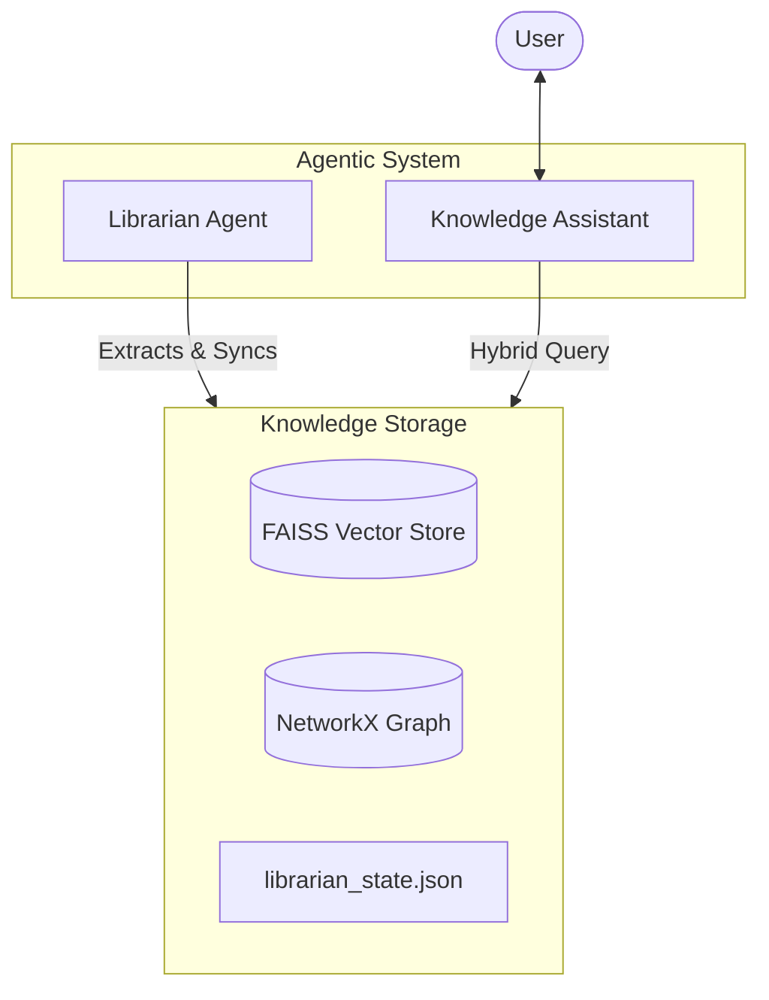
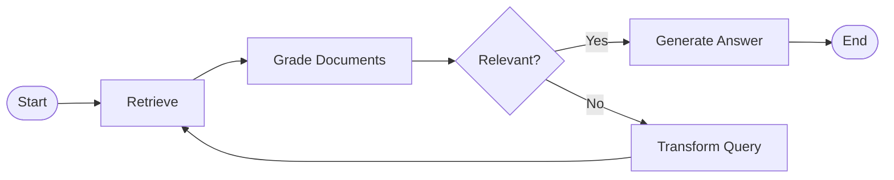

# System Architecture: Agentic GraphRAG

This document provides a deep dive into the architecture of the Agentic GraphRAG system, explaining how the Librarian and Assistant agents collaborate to provide high-quality answers using both vector and graph data.

## 1. High-Level Overview

The system is built on a **Dual-Agent Architecture** where responsibilities are split between background maintenance and foreground interaction.

## 2. Ingestion Pipeline (The Librarian)

The Librarian agent is responsible for keeping the knowledge base up to date. It performs the following steps:

1.  **File Scanning**: Walks through the `data/` directory and computes MD5 hashes for all files.
2.  **Incremental Sync**: Compares current hashes with `librarian_state.json`. Only new or changed files are scheduled for processing.
3.  **Vector Indexing**: Splits documents into chunks and generates embeddings using `FastEmbed` with `DirectML` (AMD GPU) acceleration.
4.  **Graph Extraction**: 
    -   Uses a local **Qwen2.5-0.5B** model via `LLMGraphTransformer`.
    -   Extracts nodes (Entities) and edges (Relationships).
    -   Performs normalization (Case/Whitespace) to ensure node consistency.
5.  **Persistence**: Saves the FAISS index and the NetworkX graph (`graph_index.json`).

## 3. Query & Retrieval (The Assistant)

The Assistant uses a **LangGraph State Machine** to handle user queries. It implements a "Hybrid RAG" strategy.

### Hybrid Retrieval Process:
1.  **Vector Retrieval**: Standard semantic search against the FAISS index to find relevant text chunks.
2.  **Graph Retrieval (Entity Linking)**:
    -   **Extraction**: LLM extracts key entities from the user's question.
    -   **Linking**: Uses fuzzy matching (`difflib`) to map extracted entities to existing nodes in the NetworkX graph.
    -   **Traversal**: Retrieves the 1-hop neighbors and relations for each linked node.
3.  **Context Fusion**: Combines vector chunks and graph triplets into a single prompt for the generator (DeepSeek).

## 4. Self-Correction Mechanism

The system doesn't just return the first result. It includes a validation step:
-   **Grader**: A dedicated LLM call that checks if the retrieved documents are actually relevant to the question.
-   **Transform Query**: If the context is insufficient, the agent rewrites the question to improve retrieval performance in the next iteration.

## 5. Hardware Optimization

-   **DirectML**: Used to offload embedding generation to AMD GPUs (Strix Halo/AI Max+).
-   **Local LLM**: Qwen 0.5B is used for graph extraction to minimize costs and latency for the metadata extraction phase.

